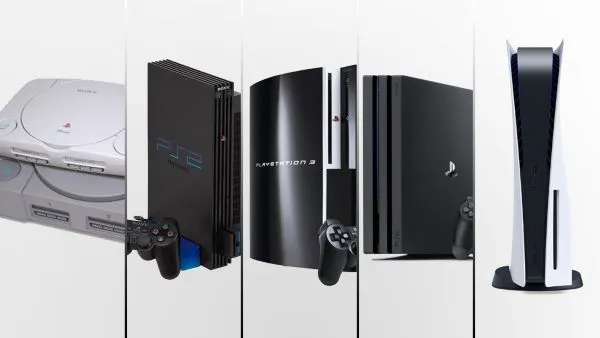
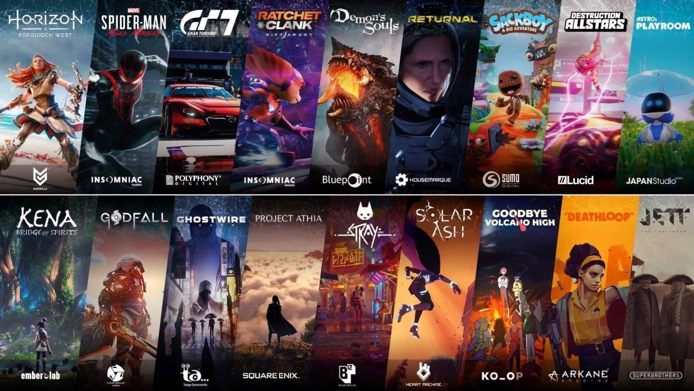
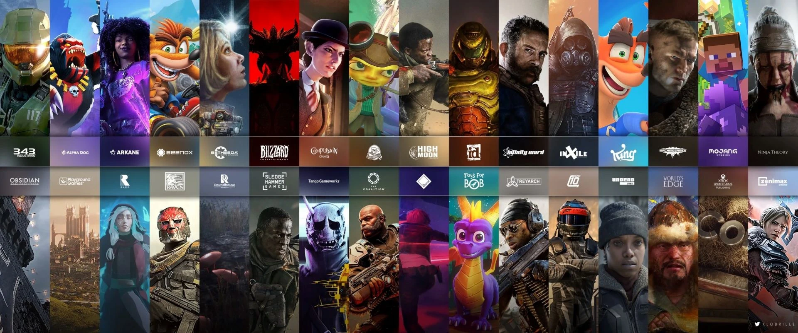
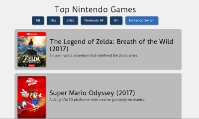
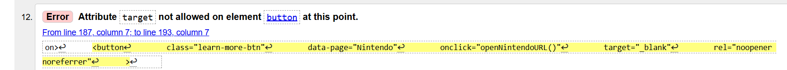

  

# Welcome to Console Nostalgia

### Project Description

This project offers a captivating journey through the world of top-tier gaming, showcasing the most acclaimed consoles from PlayStation, Nintendo, and Xbox. Immerse yourself in the details of each powerful system and discover the highest-rated video games that define their legacies. From thrilling adventures to immersive storytelling, get a glimpse into the experiences that have captivated players and critics alike.

Crafted with a blend of dynamic JavaScript, structured HTML, and stylish CSS, this website delivers a functional yet playful experience designed purely for the joy of reminiscing. Navigate through a visually engaging interface that brings to life some of the most iconic gaming consoles alongside their most celebrated games. The interactive elements, powered by JavaScript, ensure a smooth and responsive journey as you explore these gaming milestones. While the site serves no practical purpose beyond nostalgia, its engaging design and user-friendly features aim to evoke fond memories and spark conversations about your favourite gaming moments.

### Project Frontpage


### Website responsivenes


---

## Table of contents

1. UX
   - User stories

2. Design
   - Wireframes

3. Features
   - Existing features
   - Future features

4. Technologies
   - Languages
   - Frameworks, libraries, and programs

5. Testing
   - Validator
   - Lighthouse
   - JSHint
   - Wave
   - Manual

6. Deployment

7. Credits and References
   - Content
   - Media
   - Acknowledgements

---

## 1. UX

### User Stories

This website aims to inform users about highly-rated games from top-tier PlayStation, Nintendo, and Xbox consoles. By creating an engaging and dynamic experience, the site intends to inspire users to explore new gaming experiences and discover titles they may have missed. Additionally, the website provides links to relevant web pages for users seeking more detailed information about specific games.

## 2. Design

The website's design emphasizes a minimalist and clean aesthetic, drawing inspiration from the color palettes of the consoles themselves. This approach is balanced with elements of fun and creativity. The site incorporates both light and dark modes, and features large, user-friendly icons to enhance accessibility. Originally, console and game pages were structured as lists, but were redesigned using carousels to provide a more engaging and dynamic user experience.

The main colours used throughout are as follows:

 
 

### Wireframe

1. Mobile Wireframe


2. Desktop Wireframe


---

## 2. Features

### Existing Features

__Frontpage GIFs__

  - The use of GIFs on hover for the frontpage image tiles enhances the users' experience, promoting interactivity and engagement.
  
  
  
  

```
const tiles = document.querySelectorAll(".tile");

tiles.forEach((tile, index) => {
  const gif = document.createElement("img");
  gif.src = `assets/gifs/${index + 1}.gif`;
  gif.loop = true;
  gif.classList.add("gif-replacement");
  gif.style.display = "none";

  const existingContent = tile.innerHTML;
  const contentWrapper = document.createElement("div");

  contentWrapper.innerHTML = existingContent;
  tile.innerHTML = "";
  tile.appendChild(contentWrapper);
  tile.appendChild(gif);

  tile.addEventListener("mouseover", () => {
    gif.style.display = "block";
    contentWrapper.style.display = "none";
  });

  tile.addEventListener("mouseout", () => {
    gif.style.display = "none";
    contentWrapper.style.display = "block";
  });
});
```

__Wrapper__

  - Content is loaded using a wrapper instead of separate pages for a more dynamic user experience.

```
/**
 * Loads content dynamically into the wrapper div based on the selected page.
 * @param {string} page - The name of the page to load ('home', 'ps', 'ns', or 'xbox').
 */
function pageSelect(page) {
  switch (page) {
    case "home":
      window.location.reload();
      break;
    case "ps":
      wrapper.innerHTML = `
        <div class="ps-container">
          <a href="ps.html" id="ps-style">
          
          <a href="ps-games.html" id="ps-games-style">
          
        </div>
      `;
      break;
    case "ns":
      wrapper.innerHTML = `
      <div class="ns-container">
        <a href="ns.html" id="ns-style">
        
        <a href="ns-games.html" id="ns-games-style">
        
      </div>
      `;
      break;
    case "xbox":
      wrapper.innerHTML = `
      <div class="xbox-container">
        <a href="xbox.html" id="xbox-style">
        
        <a href="xbox-games.html" id="xbox-games-style">
        
      </div>
      `;
      break;
    default:
      console.error(`Invalid page selected: ${page}`);
      wrapper.innerHTML = `
        <h1>Page Not Found</h1>
        <br>
        <p>The requested page could not be found.</p>
      `;
  }
}
```
__Consoles Carousel__

  - By incorporating carousels, the website offers a more enjoyable and playful experience, benefiting user experience.

  

```
/**
 * @file Initializes Bootstrap carousels for the PlayStation, Xbox, and Nintendo timelines.
 *
 * @description This function uses jQuery to target specific HTML elements by their ID
 * and initialize them as Bootstrap carousels.  The carousels are configured with a
 * 5-second interval between slides and are set to loop continuously.  This script
 * should be included in a web page that uses Bootstrap's carousel functionality
 * and contains elements with the IDs 'ps-timeline-carousel',
 * 'xbox-timeline-carousel', and 'nintendo-timeline-carousel'.
 *
 * @requires jQuery
 * @requires Bootstrap
 *
 * @function
 * @listens document#ready
 *
 * @returns {void}
 */
window.onload = function () {
  $("#ps-timeline-carousel").carousel({
    interval: 5000,
    wrap: true,
  });
  $("#xbox-timeline-carousel").carousel({
    interval: 5000,
    wrap: true,
  });
  $("#nintendo-timeline-carousel").carousel({
    interval: 5000,
    wrap: true,
  });
};
```

__Games Filtering__

  - The website features a game filter that lets you view different consoles and quickly find the two top-rated games for each one.

  

```
/**
 * Displays a list of games in the specified HTML element.
 * @param {Array} games - An array of game objects to display.
 * @param {string} gameListId - The ID of the HTML element where the game list will be rendered.
 */
function displayGames(games, gameListId) {
  const gameList = document.getElementById(gameListId);
  gameList.innerHTML = "";

  games.forEach((game) => {
    const gameItem = document.createElement("li");
    gameItem.classList.add("game-item");
    gameItem.innerHTML = `
      
      <div class="game-details">
        <h3>${game.title} (${game.year})</h3>
        <p>${game.description}</p>
      </div>
    `;
    gameList.appendChild(gameItem);
  });
};
```
### Future Features

- As a design enhancement, controller buttons will be implemented on the console and games pages. These interactive elements will allow users to easily navigate to different areas of the site, thereby reinforcing the website's overall objective.
- The user-submitted favourite games will be captured via the form element and stored in a backend database. This data will then dynamically update the website, showcasing the collective favourite games alongside the curated selections.

---

## 3. Technologies

### Languages used

1. [HTML5](https://en.wikipedia.org/wiki/HTML)
2. [CSS3](https://en.wikipedia.org/wiki/CSS)
3. [JavaScript](https://en.wikipedia.org/wiki/JavaScript)

### Framework, libraries, and programs

1. [Bootstrap 5.3:](https://getbootstrap.com/)
   - Bootstrap has been used for overall formatting of the webpage.
2. [Google Fonts:](https://fonts.google.com/)
   - Google Fonts provided me with the 3 different fonts I have used.
3. [Font Awesome:](https://fontawesome.com/)
   - Font Awesome allowed me to use the icons required for the footer section.
4. [Visual Studio Code:](https://code.visualstudio.com/)
   - VS Code has been used to write the code and commit and push to GitHub.
5. [GitHub:](https://github.com/)
   - GitHub is used to store and interact with the code once pushed from VS Code.
6. [Balsamiq:](https://balsamiq.com/)
   - Balsamiq has been used create the wireframes.
7. [Fontjoy:](https://fontjoy.com/)
   - Fontjoy was used to generate random font pairings.
8. [Coolors:](https://coolors.co/)
   - Coolors was used to generate random colour pairings for the overall design of the website, and as a contrast checker during WAVE testing.
9. [Hover.css:](https://ianlunn.github.io/Hover/)
   - Hover.css has been used to add the float transition to the social links in the footer section.
10. [CSS autoprefixer:](https://autoprefixer.github.io/)
    - Autoprefixer parsed my CSS and added vendor prefixes.
11. [Pexels:](https://www.pexels.com/)
    - Pexels has been used for the addition of stock photos.
12. [JQuery:](https://jquery.com/)
    - JQuery has been used for JavaScript elements.
13. [Ezgif:](https://ezgif.com/)
    - Ezgif has been used to reduce the size and optimise the gifs for use in the readme.

---

## 4. Testing

1. Validator testing
   - [W3C HTML Validator](https://validator.w3.org/)
   - [W3C CSS Validator](https://jigsaw.w3.org/css-validator/)
2. Lighthouse testing
   - Google Chrome Developer Tools
3. JSHint testing
   - [JSHint](https://jshint.com/)
4. Wave testing
   - [WAVE](https://wave.webaim.org/)
5. Manual testing

### Validator Testing

1. HTML Validator Results

   - One error was found within the button element:



The code read:
```
      <button
        class="learn-more-btn"
        data-page="Nintendo"
        onclick="openNintendoURL()"
        target="_blank"
        rel="noopener noreferrer"
      >
        Learn More
      </button>
```

After modifying the JavaScript code, I was able to remove the "target" and "rel" attributes. This adjustment resolved the issue, and the code now functions as expected without the previous error.

The code now reads:
```
      <button
        class="learn-more-btn"
        data-page="Nintendo"
        onclick="openNintendoURL()"
      >
        Learn More
      </button>
```


2. CSS Validator Results

   - No errors found.


3. Lighthouse Testing

   - Frontpage lighthouse result:


   - Console and games page results:
  


4. Wave Testing

   - During initial WAVE testing, the front page flagged several accessibility errors. Specifically, images were missing alternative text, and buttons lacked descriptive aria-labels. I also took the opportunity to address the reported alerts, enhancing the overall accessibility and user experience of the website.


The subsequent pages passed the WAVE accessibility testing without any further errors or alerts identified.

5. Manual Testing

   - The home button returns the user to the homepage.
   - The mode button toggles between light and dark color schemes.
   - Selecting a console image navigates the user to the respective console and games pages.
   - The form provides a response to user input and displays an error message if the input is less than three characters.
   - The carousel on the console pages allows users to cycle through images using the arrow controls.
   - The "Learn More" button on each console page redirects users to the official manufacturer's website for that console.

The website is compatible with Chrome, Safari, and Microsoft Edge. It has been thoroughly tested for responsiveness across a range of devices, including Samsung S23, Google Pixel 7, tablets, and laptops. User feedback from mobile devices has been integrated throughout the development process.

---

## 5. Deployment

### Forking my GitHub Repository

- To make a copy of the original version so you can view and edit within your own GitHub repositories, you should do the following:

  - Locate the [GitHub repository](https://github.com/mybluewebsite/console-nostalgia) for my website.
  - At the top of the page, below the main menu, you will find the "Fork" button.
  - Select "Create a new fork" which will rediredct you to another page where you can change the description and title.
  - Select "Create fork" which will make a copy in your own GitHub repository.

The live link can be found [here](https://mybluewebsite.github.io/console-nostalgia/).

---

## 6. Credits

### Content

This website serves as a curated guide to the pinnacle of console gaming, spotlighting top-rated PlayStation, Nintendo, and Xbox systems. For each featured console, you'll discover insightful details alongside introductions to two of their most critically acclaimed video games.

Beyond the curated selections, the site invites your personal touch, offering a space to highlight your own cherished gaming experiences.

Navigating the site is designed to be seamless for everyone. Accessibility is a priority, featuring easily distinguishable enlarged icons for the home and mode buttons, and a user-friendly light and dark mode to suit your preference.

Keen to delve deeper? Each console and game featured includes a convenient "Learn More" button, providing a direct link to the manufacturer's official website for comprehensive information.

### Media

- The photos used on all pages are either of my own belonging or obtained from [Pexels](https://www.pexels.com/).

### Acknowledgements

- Special thanks to Spence, for providing tutor support and assisting me with the completion of this project.

---

  