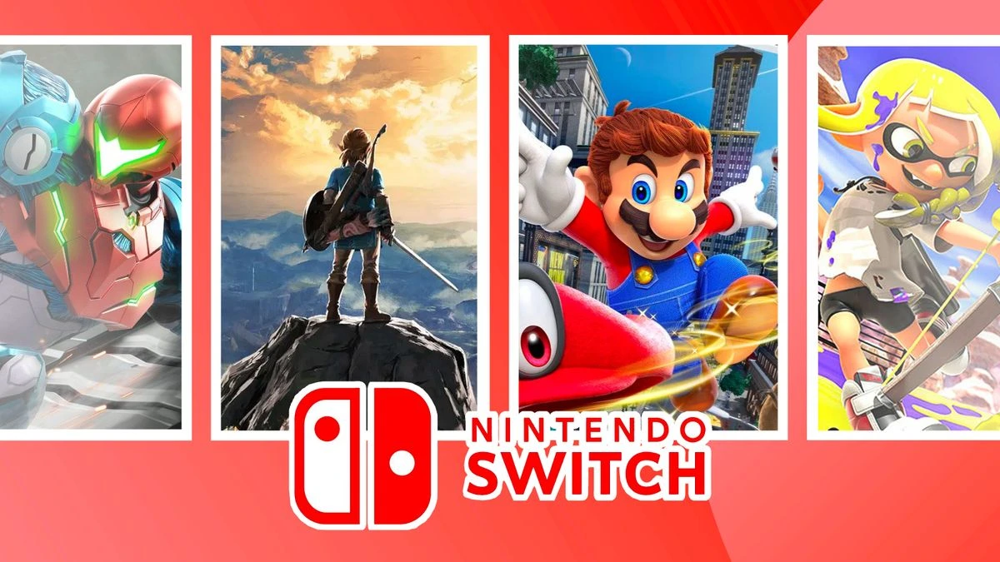

 

# Welcome to my Project Milestone 1

### Project Description

This is my first project milestone I've had to complete as part of Code Institute's Full Stack Web Application Development Programme. The website is of a minimalist design which showcases my experience within the Aviation sector and the experiences/skills I have obtained during my transition into Cybersecurity.

### Project Frontpage


---

## Table of contents

1. UX

   - User stories

2. Design

   - Wireframes

3. Features

   - Existing features
   - Future features

4. Technologies

   - Languages
   - Frameworks, libraries, and programs

5. Testing
   - Broswer testing
   - Code validation
   - Lighthouse testing
   - JShint
6. Deployment

7. Credits and References
   - Code
   - Content
   - Media
   - Acknowledgements

---

## 1. UX

### User Stories

This website aims to inform users about highly-rated games from top-tier PlayStation, Nintendo, and Xbox consoles. By creating an engaging and dynamic experience, the site intends to inspire users to explore new gaming experiences and discover titles they may have missed. Additionally, the website provides links to relevant web pages for users seeking more detailed information about specific games.

## 2. Design

The website's design emphasizes a minimalist and clean aesthetic, drawing inspiration from the color palettes of the consoles themselves. This approach is balanced with elements of fun and creativity. The site incorporates both light and dark modes, and features large, user-friendly icons to enhance accessibility. Originally, console and game pages were structured as lists, but were redesigned using carousels to provide a more engaging and dynamic user experience.

### Wireframe

1. Mobile Wireframe


2. Desktop Wireframe


---

## 2. Features

### Existing Features

__Frontpage GIFs__

  - The use of GIFs on hover for the frontpage image tiles enhances the users' experience, promoting interactivity and engagement.
  
  
  
  

```
const tiles = document.querySelectorAll(".tile");

tiles.forEach((tile, index) => {
  const gif = document.createElement("img");
  gif.src = `assets/gifs/${index + 1}.gif`;
  gif.loop = true;
  gif.classList.add("gif-replacement");
  gif.style.display = "none";

  const existingContent = tile.innerHTML;
  const contentWrapper = document.createElement("div");

  contentWrapper.innerHTML = existingContent;
  tile.innerHTML = "";
  tile.appendChild(contentWrapper);
  tile.appendChild(gif);

  tile.addEventListener("mouseover", () => {
    gif.style.display = "block";
    contentWrapper.style.display = "none";
  });

  tile.addEventListener("mouseout", () => {
    gif.style.display = "none";
    contentWrapper.style.display = "block";
  });
});
```

__Wrapper__

  - Content is loaded using a wrapper instead of separate pages for a more dynamic user experience.

```
/**
 * Loads content dynamically into the wrapper div based on the selected page.
 * @param {string} page - The name of the page to load ('home', 'ps', 'ns', or 'xbox').
 */
function pageSelect(page) {
  switch (page) {
    case "home":
      window.location.reload();
      break;
    case "ps":
      wrapper.innerHTML = `
        <div class="ps-container">
          <a href="ps.html" id="ps-style">
          
          <a href="ps-games.html" id="ps-games-style">
          
        </div>
      `;
      break;
    case "ns":
      wrapper.innerHTML = `
      <div class="ns-container">
        <a href="ns.html" id="ns-style">
        
        <a href="ns-games.html" id="ns-games-style">
        
      </div>
      `;
      break;
    case "xbox":
      wrapper.innerHTML = `
      <div class="xbox-container">
        <a href="xbox.html" id="xbox-style">
        
        <a href="xbox-games.html" id="xbox-games-style">
        
      </div>
      `;
      break;
    default:
      console.error(`Invalid page selected: ${page}`);
      wrapper.innerHTML = `
        <h1>Page Not Found</h1>
        <br>
        <p>The requested page could not be found.</p>
      `;
  }
}
```
__Consoles Carousel__

  - By incorporating carousels, the website offers a more enjoyable and playful experience, benefiting user experience.

  

```
/**
 * @file Initializes Bootstrap carousels for the PlayStation, Xbox, and Nintendo timelines.
 *
 * @description This function uses jQuery to target specific HTML elements by their ID
 * and initialize them as Bootstrap carousels.  The carousels are configured with a
 * 5-second interval between slides and are set to loop continuously.  This script
 * should be included in a web page that uses Bootstrap's carousel functionality
 * and contains elements with the IDs 'ps-timeline-carousel',
 * 'xbox-timeline-carousel', and 'nintendo-timeline-carousel'.
 *
 * @requires jQuery
 * @requires Bootstrap
 *
 * @function
 * @listens document#ready
 *
 * @returns {void}
 */
window.onload = function () {
  $("#ps-timeline-carousel").carousel({
    interval: 5000,
    wrap: true,
  });
  $("#xbox-timeline-carousel").carousel({
    interval: 5000,
    wrap: true,
  });
  $("#nintendo-timeline-carousel").carousel({
    interval: 5000,
    wrap: true,
  });
};
```

__Games Filtering__

  - The website features a game filter that lets you view different consoles and quickly find the two top-rated games for each one.

  

```
/**
 * Displays a list of games in the specified HTML element.
 * @param {Array} games - An array of game objects to display.
 * @param {string} gameListId - The ID of the HTML element where the game list will be rendered.
 */
function displayGames(games, gameListId) {
  const gameList = document.getElementById(gameListId);
  gameList.innerHTML = "";

  games.forEach((game) => {
    const gameItem = document.createElement("li");
    gameItem.classList.add("game-item");
    gameItem.innerHTML = `
      
      <div class="game-details">
        <h3>${game.title} (${game.year})</h3>
        <p>${game.description}</p>
      </div>
    `;
    gameList.appendChild(gameItem);
  });
};
```
### Future Features

- As a design enhancement, controller buttons will be implemented on the console and games pages. These interactive elements will allow users to easily navigate to different areas of the site, thereby reinforcing the website's overall objective.

---

## 3. Technologies

### Languages used

1. [HTML5](https://en.wikipedia.org/wiki/HTML)
2. [CSS3](https://en.wikipedia.org/wiki/CSS)
3. [JavaScript](https://en.wikipedia.org/wiki/JavaScript)

### Framework, libraries, and programs

1. [Bootstrap 5.3:](https://getbootstrap.com/)
   - Bootstrap has been used for overall formatting of the webpage.
2. [Google Fonts:](https://fonts.google.com/)
   - Google Fonts provided me with the 3 different fonts I have used.
3. [Font Awesome:](https://fontawesome.com/)
   - Font Awesome allowed me to use the icons required for the footer section.
4. [Gitpod:](https://www.gitpod.io/)
   - GitPod was used to write the code and commit and push to gitHub.
5. [GitHub:](https://github.com/)
   - GitHub is used to store and interact with the code once pushed from gitPod.
6. [Balsamiq:](https://balsamiq.com/)
   - Balsamiq has been used create the [wireframes](assets/project_milestone_1_template.bmpr).
7. [Fontjoy:](https://fontjoy.com/)
   - Fontjoy was used to generate 3 random font pairings.
8. [Coolors:](https://coolors.co/)
   - Coolors was used to generate random colour pairings for the overall design of the website.
9. [Hover.css:](https://ianlunn.github.io/Hover/)
   - Hover.css has been used to add the float transition to the social links in the footer section.
10. [CSS autoprefixer:](https://autoprefixer.github.io/)
    - Autoprefixer parsed my CSS and added vendor prefixes.
11. [Pexels:](https://www.pexels.com/)
    - Pexels has been used for the addition of stock photos.
12. [JQuery:]()
    - JQuery has been used for JavaScript elements.

---

## 4. Testing

1. Validator testing
2. Lighthouse testing
3. JSHint testing
4. Wave testing
5. Manual testing

### Validator Testing

1. HTML Validator Results
   - Initially there were a few issues with the HTML code (seen below), these errors have since been corrected.
     
     
     
2. CSS Validator Results

   - No CSS errors found, there are multiple warnings referencing the vendor prefixes (seen below).
     
     

3. Lighthouse Testing

   - All pages have been tested using "Lighthouse" testing within Google Chrome "Developer tools". All pages scored well within the 90's.
     

4. Wave Testing

   - All pages have been tested using [Wave](https://wave.webaim.org/). No errors were found.
     
     
     

5. Manual Testing

   - Selecting the navbar elements takes you to their respective pages.
   - Selecting "Download CV" downloads and opens the CV in a new tab.
   - Selecting either of the social links takes you to their respective webpages.
   - Clicking "Send" on the form without inputting data will bring up a caution message.
   - Clicking the arrows on the carousel on the "Work Experience" page will allow you to cylce through the images.

The program is compatible with Chrome, Safari, and Microsoft Edge. The website has been thoroughly tested and is fully responsive across various devices, including Samsung S23, Google Pixel 7, tablets, and laptops. Feedback from mobile users was incorporated throughout the development process.

### Known Bugs

- Added a ":focus-within" pseudo-class as an attempt to change the blue box shadow of the input forms on the contact page.
- When running "Lighthouse" on the frontpage, the aspect-ratio of the hero img is incorrect and decreases overall performance score.

---

## 5. Deployment

### GitHub Pages

- The site was deployed to GitHub pages. The steps to deploy are as follows:
  - In the specific [GitHub repository](https://github.com/), navigate to the "Settings" tab.
  - Scroll down until you see "pages" on the left-hand side.
  - From the "Branch" sub-section, under the "Build and Deployment" section, from the drop-down menu, select "main" and save.
  - You will find the deployed site under "Github Pages" showing your live site and it's URL, allowing you to navigate to the deployed website.

### Forking your GitHub Repository

- To make a copy of the original version so you can view and edit within your own GitHub repositories, you should do the following:
  - Locate the [GitHub repository](https://github.com/) in question.
  - At the top of the page, below the main menu, you will find the "Fork" button.
  - Select "Create a new fork" which will rediredct you to another page where you can change the description and title.
  - Select "Create fork" which will make a copy in your own GitHub repository.

The live link can be found [here](https://mybluewebsite.github.io/Project_Milestone_1/index.html).

---

## 6. Credits

### Content

- "Lorem ipsum" used as placeholder text throughout the website.
- The icons in the footer were taken from [Font Awesome](https://fontawesome.com/).
- [Google](https://www.google.com/) has been used to create a "::before" pseudo-class for the "Frequently Asked Questions" section to replace the bullet-points.
  

### Media

- The photos used on all pages are either of my own belonging or obtained from [Pexels](https://www.pexels.com/).

### Acknowledgements

- Special thanks to [Code Institute](https://codeinstitute.net/) for providing a sample README to edit accordingly.
- Thank you to Spence, for providing tutor support and assisting me with the completion of this project.

---

 
